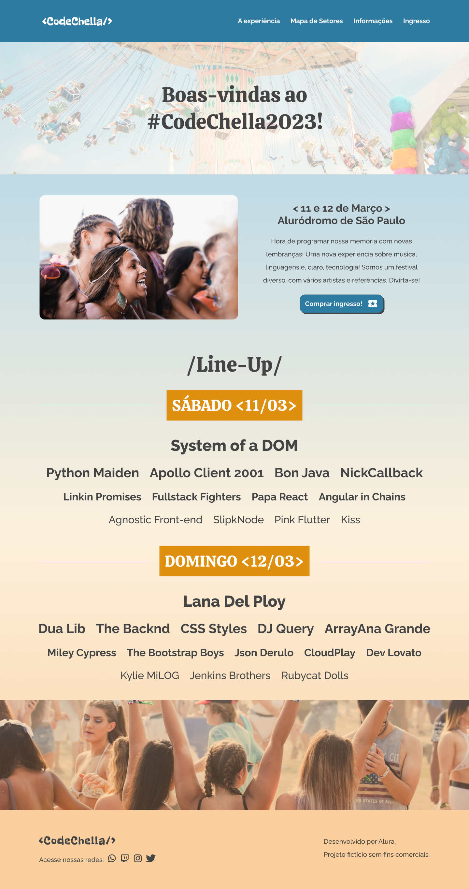

# CodeChella
> 6º Challenge Front-End Alura
&nbsp;
# Contents
- [CodeChella](#codechella)
- [Contents](#contents)
- [About](#about)
    - [6º Challenge Front-End Alura](#6º-challenge-front-end-alura)
- [Installation](#installation)
    - [Pre-requisites](#pre-requisites)
    - [Run this project](#run-this-project)
      - [Clone this repository](#clone-this-repository)
      - [Install the dependencies](#install-the-dependencies)
    - [Run the project](#run-the-project)
- [Technologies](#technologies)
# About
### 6º Challenge Front-End Alura
- [ x ]  Home
- [ x ]  The experience
- [ x ]  Map of Sectors
- [ x ]  General information
- [ x ]  Secure your ticket
- [ x ]  Purchased Ticket

&nbsp;
# Installation
### Pre-requisites

Before starting, you will need to have the following tools installed on your machine: [Git](https://git-scm.com), [Node.js](https://nodejs.org/en/) and [Npm](https://www.npmjs.com/). It's good to have an editor to work with the code like [VSCode](https://code.visualstudio.com/).

### Run this project 
#### Clone this repository
```bash
gh repo clone felipecepluki/codechella
```

#### Install the dependencies
```bash
npm install
```

### Run the project
```bash
npm run dev
```

# Technologies
The following tools were used in building the project: <br />


